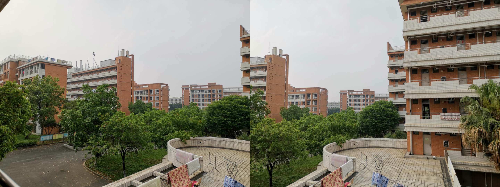
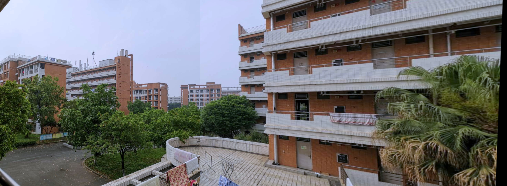

# Image Stitching Based on SIFT,SUFT and ORB

本项目使用opencv制作的一个基于特征点识别的图像拼接库，流程如下：
1. 基于SIFT,SUFT或ORB算法提取特征点
2. 去除野点
3. 基于cv::BFMatcher进行特征点匹配
4. 计算变换矩阵，进行图像拼接
5. 图像融合

调用细则可查看ImageStitching/ImageStitching.h注释。

效果示例图：

原图

拼接效果

